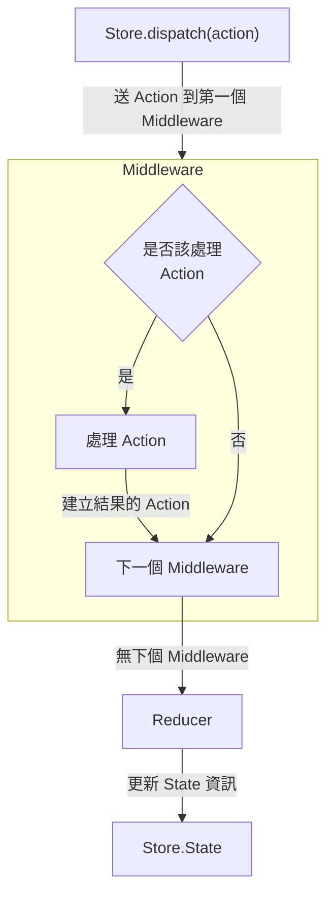
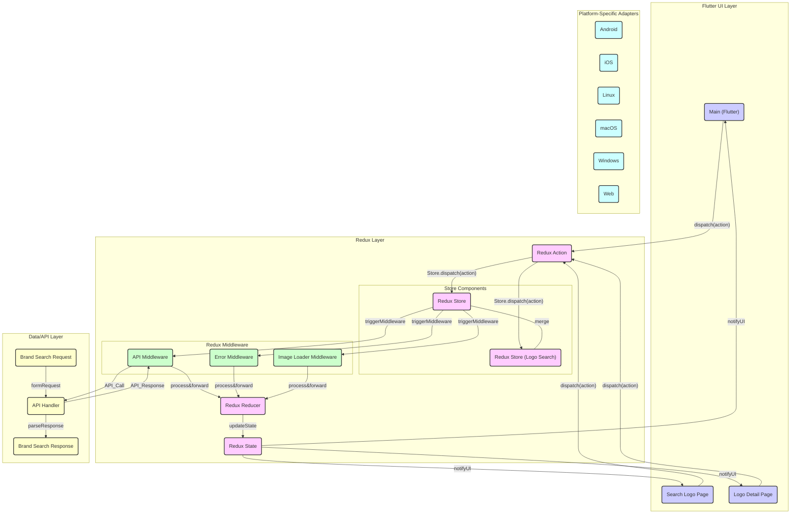

# LogoSearch_flutter
Redux 與 Flutter 連動的練習專案，使用 [Logo.dev](https://www.logo.dev) 作為資料來源。

## Redux 架構

### Store

Redux 的架構核心，處理 Action 傳遞給 Reducer 的資料流，並且持有 state。

### State

資料保存的地方，透過 Store 來管理，View 使用 combine 來訂閱 state 的變化，
它是一個統一的資料來源，讓所有 View 可以取得最新的資料。

### Action

用來描述發生了什麼事情，透過 Store.dispatch 來發送 Action，並且透過 Reducer 來更新 state。

### Middleware

處理 Action 的請求，如：api、log、錯誤處理等。

### Reducer

處理 Action 的結果，並且更新 state。

## Redux 資料流

## 架構圖

